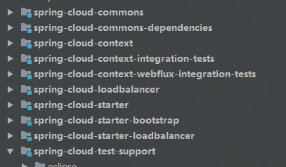
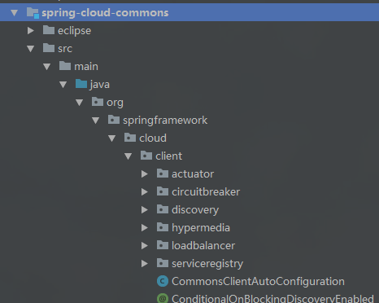

# spring-cloud-common简介

为了书写方便，我们约定`spring-cloud-common`简写为scc或者scc。如果SCC或者scc有特殊情况，我会特别单独说明。

## 一、什么是Spring Cloud

官网定义：

>Spring Cloud provides tools for developers to quickly build some of the common patterns in distributed systems (e.g. configuration management, service discovery, circuit breakers, intelligent routing, micro-proxy, control bus, one-time tokens, global locks, leadership election, distributed sessions, cluster state). Coordination of distributed systems leads to boiler plate patterns, and using Spring Cloud developers can quickly stand up services and applications that implement those patterns. They will work well in any distributed environment, including the developer’s own laptop, bare metal data centres, and managed platforms such as Cloud Foundry.

简单的翻译过来就是"Spring Cloud是一个在分布式系统开发中的工具集，使用Spring Cloud的可以快速的搭建起分布式服务或者应用"。

具体几个关键点：

- scc同两个模块组成：Spring Cloud Context和Spring Cloud Common。
- Spring Cloud Context 为Spring Cloud应用提供了统一的ApplicationContext管理。具体实现是Spring Cloud Context作为Spring Application Context的父Context。在引导时初始化加载。
- Spring Cloud Common提供了一系列的抽象和通用的实现，方便开发者切换底层的不同具体实现。

因此，我们要自已实现一些功能 ，需要与Spring Cloud的集成  ，就需要参考Spring cloud Common给我们预留的扩展点和相应的具体规范。

那么这个"tools"是Spring cloud自己实现还是和Spring一样集成第三方实现呢？当然是集成第三方啦。最初版本主要是依赖于netflix的相关实现，其中netflix的相关实现也成为了Spring Cloud的默认标准。Spring Cloud担任了集成的角色，将这些组件很好的与spring 集成到一起能很好的工作。

那这种集成肯定需要一种规范或者标准。在Java编程界里，这种规范或者标准需要**抽象**来实现。即定义相关的接口与抽象类，从而定义好整个系统的框架，再提供一些默认的实现。并且给开发者们提供了足够灵活的可扩展点，方便开发者们进们相关扩展和相应的实现替换。

这种抽象，被独立出来一个模块，这就是Spring Cloud Common.

## 二、什么是Spring Cloud Commons

参考官方定义：

> Spring Cloud Commons delivers features as two libraries: `Spring Cloud Context` and `Spring Cloud Commons`. Spring Cloud Context provides utilities and special services for the ApplicationContext of a Spring Cloud application (bootstrap context, encryption, refresh scope and environment endpoints). Spring Cloud Commons is a set of abstractions and common classes used in different Spring Cloud implementations (eg. Spring Cloud Netflix vs. Spring Cloud Consul).

对上面官网定义进行一下简单翻译：

Spring Cloud Commons由两部分组：

- Spring Cloud Context
  - 这是对ApplicationContext相关实现(SpringCloud是基于Spring实现的，通过父子容器来实现自己的ApplicationContext)。这个SpringCloud ApplicationContext提供了引导Context( bootstrap Context,比如从配置中心读取相应的配置，然后才启动Spring上下文等)，可以动态刷新Context，以及提供evn 相关的endpoiont
- Spring Cloud Commons
  - 这一层就是一系列的抽象(接口，标准，规范)和一些通用的实现类(框架的通过实现，预留好扩展点)。通过通过部分抽象和实现，可以方便的切换具体底层技术的实现。比如pring Cloud Netflix vs. Spring Cloud Consul。或者现在比较流行的SpringCloud的alibaba.com。

总之，Spring Cloud Commons是Spring Cloud的精华所在。极有高度的抽象，NB.

### 项目模块

- spring-cloud-context

  - ApplicationContext 实现

- spring-cloud-commons

  - 通过用的抽象实现

    

  从通用实现的源码可以看出，主要包括：监控(acruator)模块，服务熔段模块(circuitbreadker),服务发现模块(discovery)，服务注册模块(servicerregistry),服务负载均衡模块(loadbalancer)。以及一个超媒体（hypermedia）。

  因此，我们可以看出来，spring-cloud-commons包含了分布式中的关键模块抽象：服务发现注册，服务熔段降级，服务的负载均衡等关键模块。在Spring cloud 2.0之前，默认实现是netflix那一套。在这个发展过程，spring cloud alibaba也诞生了，Spring cloud alibaba就是通过扩展这些扩展点从而达到与SpringCloud集成 。

  

## 三、Spring Cloud Context特点

- Bootstrap Context
  - 引导Context，作为应用的context的父context。
- `TextEncryptor` beans
  - TODO： 应该是配置属性加密的Bean
- Refresh Scope
  - 扩展 了Spring Bean 的作用域，默认有single,global,session,request等。现在添加了一个Refresh Scope，表示可以刷新的Bean。
- Spring Boot Actuator endpoints for manipulating the `Environment`
  - Acturator端点，用来控制Spring cloud应用的Environment，即配置项。

## 四、Spring cloud common 特点

- `DiscoveryClient` interface
  - 服务发现抽象 ，统一了服务发现编程模型
- `ServiceRegistry` interface
  - 服务注册抽旬，统一了服务注册编程模型
- Instrumentation for `RestTemplate` to resolve hostnames using `DiscoveryClient`
  - 集成了RestTemplate组件，可以通过DiscoverClient配置，支持hostname实现服务调用，从而屏蔽具体的ip:port这种模式。